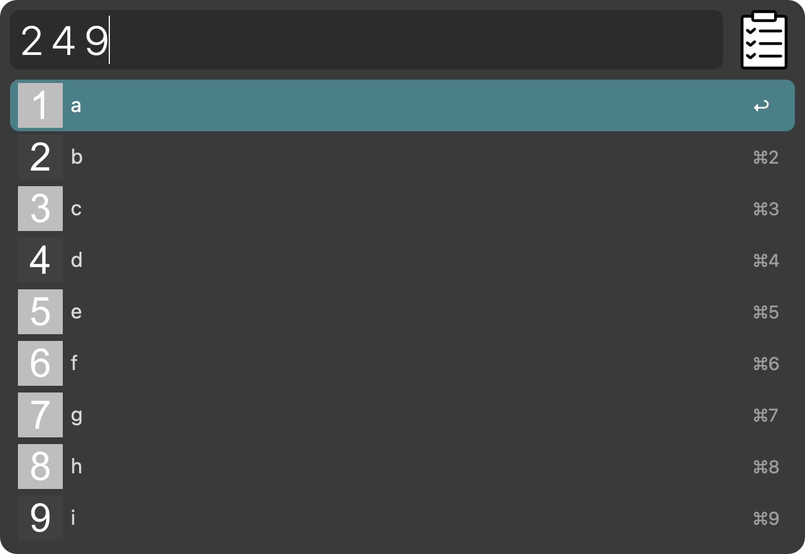

# Clipboard Picker

## 1. Picker

Keyword: `clippick`  
Shortcut: `cmd+option+shift+v`

When launched, opens a clipboard history facsimile. Enter clipboard items numbers separated by space and those items will be pasted together upon hitting enter.

## 2. Paste last *n*

Keyword: `paste`  
Shortcut: `cmd+option+ctrl+v`  
Snippet: `ppaste`

Pastes last *n* items from the clipboard. Use `option` modifier to reverse pasted order.
